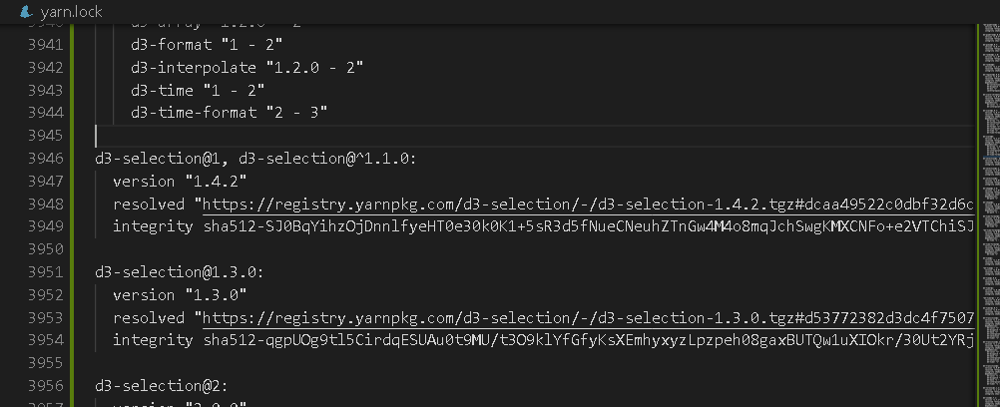
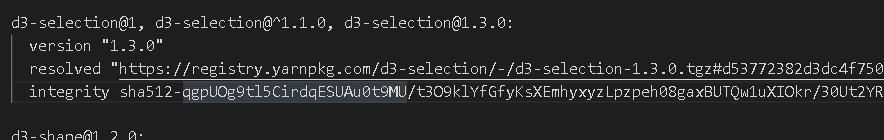

# Family Tree Example using d3-dtree react

Demo is available on [fam-tree](https://fam-tree-bhagat.herokuapp.com/)

### Tech

It uses:

* [ReactJS](https://reactjs.org) - A Javascript Library for building user interfaces
* [d3](https://d3js.org) - A library for data visualization
* [d3-dtree](https://github.com/ErikGartner/dTree/blob/master/README.md) - A library for visualizing data trees with multiple parents built on top of D3

### Installation

It requires [Node.js](https://nodejs.org/) to run.

Install the dependencies and devDependencies and start the server.

```sh
$ cd famTree
$ yarn install
$ yarn start
```

### Errors that may encounter while starting app
```diff
- TypeError: selection.interrupt is not a function
```

- It is due to multiple version of d3-selection

### Solution
 Due to multiple versions of d3-selection


Merge all versions of d3-selection


License
----

MIT


**Free Software, Hell Yeah!**

